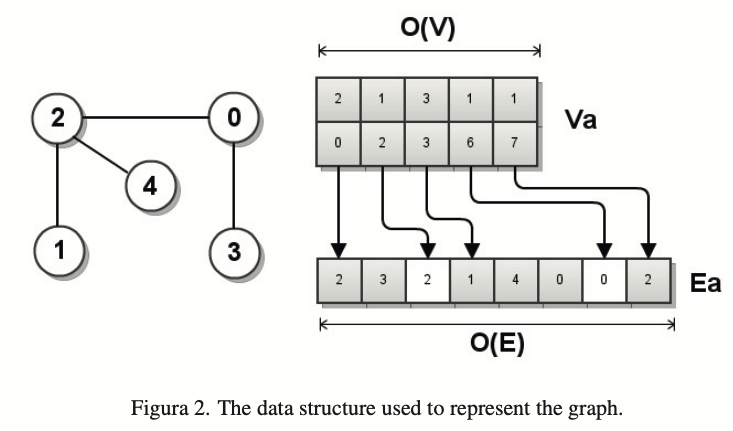
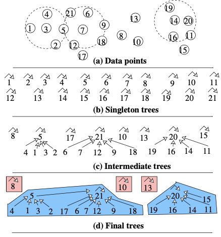
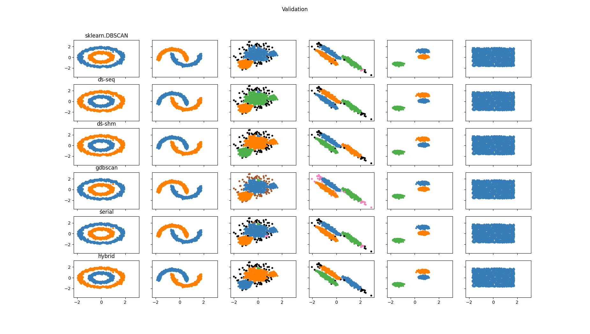

# SUMMARY
We accelerated a common clustring model **dbscan** with different parallelism implementation and data structure, on a device with 8 cores cpu and a nvidia gpu card, we achive:**(x16 speedup)** with CUDA, **(x4)** with CPU thread-parallel, and **(x41)** with a hybrid approach, compared to sequential CPU implementation.

# BACKGROUND
dbscan is an efficient density-based clustering algorithm. It clusters given points and output labels of those points. It's behavior is controlled by two parameters: **eps** and **minPoints**. It scans the points iteratively, the point with number of neighbors greater than minPoints is marked as core. An core point (red point the figure) will start to scan its neighborhood by taking neighbor's neighbor into the cluster with a bfs manner. If a point is a neighbor of core point, but itself is not a core, we mark such point as border (as the leaf nodes of last level in bfs search). If the point cannot be clusterd, it is marked as noise.

<figure>
  
  <figcaption>figure from ReaserchGate</figcaption>
</figure>

# APPROACH & RESULT
## Dataset
In this project, we mainly focus on 2D data points clustering. 

We adopted sklearn's sample data (lenght: 1500, minPoints: various, eps: various) (https://scikit-learn.org/stable/auto_examples/cluster/plot_cluster_comparison.html#sphx-glr-auto-examples-cluster-plot-cluster-comparison-py) for **correctness validation** purpose (**the validation result is available in appendix**). 

For **peformance benchmark**, we download the twitter dataset from the HPDBSCAN paper (https://b2share.eudat.eu/records/7f0c22ba9a5a44ca83cdf4fb304ce44e). According to the paper,  we set minPoints as 40, eps: 0.01. Since the original twitter data's length is too large (3704351), we further random sample 20000, 50000, 100000, 200000 as our benchmark dataset. 

## Target Device
The experiments is carried on my workstation (CPU:Intel(R) Core(TM) i7-7700K CPU @ 4.20GHz, GPU: NVIDIA Corporation GP106 [GeForce GTX 1060 3GB]). It's performance should be similar to GHC machines with gpu card according to my experience from homeworks (actually GHC has better nvidia card than mine). 

## Related Works
In this course, we have learned several potential approaches to make things parallel:
- under shared memory space
  + multi-process(threads)
- under distribued memory space
  + message passing
- utilize data parallel
  + SIMD/CUDA

There are a lot existed research on parallel dbscan. In this project, we implement GDBSCAN(cuda) and PDSDBSCAN(shared-memory). We also propose a hybrid approach to utlize both cuda and multi-thread to achive better speed up on our target device.

Notice that in the PDSDBSCAN, it also provides a message passing approach. But it requires to implement rpc to support its query based message.

## Program Overview
As we did in hw3, hw4, we wrote a C++ program which takes command line arguments:
```bash
Usage: ./main [options]
Program Options:
        -f <input_filename> (required)
        -b <backend_method> (default:0) (0:seq, 1:gdbscan, 2:ds-seq, 3:ds-shm 4:hybrid)
        -t <num_threads_omp> (default:1)
        -?  --help             This message
```
and it will load the input data, call the corresponding backend method (record time), and write labels to output file.

### GDBSCAN
We followed the paper G-DBSCAN to explore the cuda based parallelism of DBSCAN. The idea this is to decoupling the neighborhood calculation and labeling into two different stages (graph construction, bfs clustring) to further utlize parallelism.

**stage 1: graph construction**

One dimension of parallelism is that we need to compute all neighbords and store them for each point. In the G-DBSCAN paper, it propose an efficient graph data structure with vertecies and edge information, correspondingly Va(degree, startIdx) and Ea(neighborIdx).
<figure>
  
  <figcaption>Figure from G-DBSCAN</figcaption>
</figure>

The first row of Va, Va_degree, stores the degree (number of neighbords) for each point. The second row of Va, Va_startIdx, store the start index of neighbords in Ea. In other words, the neighbords of point **i**, is **Ea[Va_startIdx[i]:Va_startIdx[i]+Va_degree[i]]**.

```C++
__global__ void collectDegreeKernel(const float2* points, const int num_points, const float eps, int* degree) {
    int idx = blockIdx.x * blockDim.x + threadIdx.x;
    if (idx >= num_points) return;
    float2 p_a = points[idx];
    int d = 0;
    for (int i=0; i<num_points; i++) {
        if (idx == i) continue;
        float2 p_b = points[i];
        if (distance(p_a, p_b) <= eps) {
            d++;
        }
    }
    degree[idx] = d;
}
```

We first collect the degree of each point by **collectDegreeKernel** where each point is mapped to a cudaThread. As Va_startIdx is essensially the prefix sum of Va_degree. Recall that from hw2, we can utilize **thrust::exclusive_scan** to efficient compute Va_startIdx. Finally, we construct **Ea** with **constructEaKernel** and classify each point (core/border/noise) with **classifyKernel**.

```C++
__global__ void constructEaKernel(const float2* points, const int* Va_degree, const int* Va_idx, 
  int num_points, const float eps, int* Ea) {
    int idx = blockIdx.x * blockDim.x + threadIdx.x;
    if (idx >= num_points) return;
    int start_idx = Va_idx[idx];
    float2 p_a = points[idx];
    for (int i=0; i<num_points; i++) {
        if (idx == i) continue;
        float2 p_b = points[i];
        float dis = distance(p_a, p_b);
        if (dis <= eps) {
            Ea[start_idx] = i;
            start_idx++;
        }
    }
}

__global__ void classifyKernel(int num_points, int minPoints, int* Va_degree, int* type) {
    int idx = blockIdx.x * blockDim.x + threadIdx.x;
    if (idx >= num_points) return;
    if (Va_degree[idx] >= minPoints) {
        type[idx] = 1; // core
    } else {
        type[idx] = 2; // noise
    }
}
```

#### stage 2: bfs clustring
As described in the sequential approach, the neighborhoods starts with a single core point, then we continually grow the neighborhoods by adding the neighbords of points in the neighborhoods. It is essentially a bread-first-search process, where the core points start at level 0 and its neighboards starts at level 1 and so on. While we can paralle the neighborhood exploration in the same level, we have to do level-to-level synchronization. 

Here is an overview of how we implement bfs (with some malloc/memcpy details ommited). We define two array *Fa* and *Xa*. Fa marks whether the point is activated to add its neighbords in the next iteration (like the queue we maintain the children in BFS). Xa marks whether the point is visted in this bfs scan, if it is, then cluster it with same label. We also utilize **thrust::transform_reduce** to efficient detect if Fa is all zero to stop bfs.
```C++
void bfs(int idx, int label, int num_points, bool* visited, int* labels, int* type, int* Va_degree, int* Va_idx, int* Ea, int minPoints) {
    bool* Fa_host = (bool*)calloc(num_points, sizeof(bool));
    bool* Xa_host = (bool*)calloc(num_points, sizeof(bool));
  
    while (true) {
        int fa_sum = thrust::transform_reduce(thrust::device,
                                        Fa_cu, Fa_cu + num_points,
                                        bool2int<bool,int>(),
                                        0,
                                        thrust::plus<int>());
        if (fa_sum == 0) {
            break;
        }
        bfsKernel<<<blocks, threadsPerBlock>>>(Fa_cu, Xa_cu, Va_degree, Va_idx, Ea, type, num_points, minPoints);
    }
    for (int i=0; i<num_points; i++) {
        if(Xa_host[i]) {
            labels[i] = label;
            visited[i] = true;
            if (type[i] != 1 /*core*/) {
                type[i] = 0; /*border*/
            }
        }
    }
}
```

**performance**


From the performance evaluation, we can notice that gdbscan can achieve 10x speed up on twitter_50000 and 15x speed up on twitter_200000. To further analysis the performance, we break the time of graph_construction and bfs_scan stages.

</iframe>

We can notice that, **bfs_scan** takes much more time compared to **graph_construction**. The main reason why bfs_scan is slow is that it need level-to-level sysnchronization, and it is actually more I/O intensive than computational intensive. And we can further use **nvprof** to profile the program, which approves that bfs is the bottleneck to be optimized in gdbscan.

```bash

==6883== Profiling result:
            Type  Time(%)      Time     Calls       Avg       Min       Max  Name
 GPU activities:   60.99%  867.01ms     25660  33.788us  4.1930us  331.51us  bfsKernel(bool*, bool*, int const *, int const *, int const *, int*, int, int)
                   11.99%  170.45ms         1  170.45ms  170.45ms  170.45ms  collectDegree(float2 const *, int, float, int*)
                   11.62%  165.14ms         1  165.14ms  165.14ms  165.14ms  constructEaKernel(float2 const *, int const *, int const *, int, float, int*)
```

### Disjoint-Set (sequential)
In the paper PDSDBSCAN, it proposed a disjoint-set data structure. A disjoint-set data structure is essentially a tree structure, where each node maitains it's parent node pointer. It suppots two operation: **union** and **find**. Where **union** merge two disjoin-set together, and **find** will get the root node of a given node.

<figure>
  
  <figcaption>Figure from PDSDBSCAN</figcaption>
</figure>

```bash
// pseudocode from PDSDBSCAN paper
procedure DSDBSCAN(X, eps, minpts) for each point x ∈ X do
    p(x) ← x
    for each point x ∈ X do
        N ← GETNEIGHBORS(x, eps) if |N| ≥ minpts then
        mark x as core point
        for each point x′ ∈ N do
            if x′ is a core point then UNION(x, x′)
            else if x′ is not yet member of any cluster then mark x′ as member of a cluster
            UNION(x, x′)
```
In the sequentail implementation of disjoin-set, we first convert each data point to a root node (parent points to itself). If that node is a core point, we start to merge its neighboorhood by union. One thing worth noticing here is, compared to the sequential implementaiton we described before, it is not using a bfs-like search to growing its neighboorhood, instead, when the outer for loop reaches the neighbor points, it will be automatically clusted due to union.

Note that the algorithm described above only generates disjoint set, to label the point, we first assign each root node with different label (the root node with size=1 is considered as noise). Then each non-root node is labeled with its root's label.

As expected, the total computation cost for sequentail disjoint-set implementation is similar to the one with bfs mannaer.
<iframe width="600" height="371" seamless frameborder="0" scrolling="no" src="https://docs.google.com/spreadsheets/d/e/2PACX-1vT3AW5w-E0udZG68htpTZ-34EUSxoFRvZXAsfv-ff2P_iH52sKicwwwdOagb81FoOFfayTaTRnYuguF/pubchart?oid=400210838&amp;format=image"></iframe>

### Disjoint Tree (shared-memory parallelism)
The idea of shared-memory parallelism of disjoin tree is to partition the workload (points) and assign it to different threads. We start with **static assignment** and use **openmp** for implementation. It also contains two stages: **local computation** and **merge**.

**local computation**

```C++
// pseudocode from PDSDBSCAN paper
procedurePDSDBSCAN-S(X,eps,minpts)
for t = 1 to p in parallel do ◃ Stage: Local comp. (Line 2-18)
    for each point x ∈ Xt do p(x) ← x
    Yt ← ∅
    for each point x ∈ Xt do
        N ← GETNEIGHBORS(x, eps) if |N| ≥ minpts then
        mark x as a core point for each point x′ ∈ N do
        if x′ ∈ Xt then
        if x′ is a core point then
            UNION(x, x′)
        else if x′ ̸∈ any cluster then
            mark x′ as member of a cluster 
            UNION(x, x′) else
    Yt ←Yt ∪{(x,x′)}
    ...
```
Similarily as ds-seq, for each point, we get the neighbors and union the neighbors. The difference is, we might get neighbords outside the partition, which is processed by some other threads. So instead of applying union right now, we add such cross-thread neighbors into set **Y_t**, and postpone the union in merging stage.

**merging**

In local computation stage, each thread t store its cross-thread neighbords **Y_t** which should be unioned. So we should use union with lock, since multiple thread could modify the parent pointer of a node concurrently. Also note we implement line 23 and line 24 atomiclly using test_and_set.
```C++
procedurePDSDBSCAN-S(X,eps,minpts)
...
for t = 1 to p in parallel do ◃ Stage: Merging (Line 19-25)
    foreach(x,x′)∈Yt do
        if x′ is a core point then
            UNIONUSINGLOCK(x, x′)
        else if x′ ̸∈ any cluster then  -> line 23
            mark x′ as member of a cluster -> line 24
            UNIONUSINGLOCK(x, x′)


procedure UNIONUSINGLOCK(x, x′) 
    while p(x) ̸= p(x′) do
        if p(x) < p(y) then 
            if x = p(x) then
                LOCK(p(x))
                if x = p(x) then
                    p(x) ← p(x′) 
                UNLOCK(p(x))
                x = p(x) 
        else
            if x′ = p(x′) then 
                LOCK(p(x′))
                if x′ = p(x′) then 
                    p(x′) ← p(x)
                UNLOCK(p(x′)) 
                x′ = p(x′)
```

**performance**

Below is the performance result by running shared-memory parallel disjoin-tree dbscan on twitter_200000.
<iframe width="600" height="371" seamless frameborder="0" scrolling="no" src="https://docs.google.com/spreadsheets/d/e/2PACX-1vT3AW5w-E0udZG68htpTZ-34EUSxoFRvZXAsfv-ff2P_iH52sKicwwwdOagb81FoOFfayTaTRnYuguF/pubchart?oid=643796066&amp;format=image"></iframe>

We can see that the speedup align linearly with number of threads well until 4. Since we are running on 8 core machine, we expect it should achive speedup from 4 to 8 while it doesn't.

We first look into the execution time breakdown between two stages as below (with 8 threads on twitter_200000), which shows that the local computation stage takes the majority of time.
<iframe width="600" height="371" seamless frameborder="0" scrolling="no" src="https://docs.google.com/spreadsheets/d/e/2PACX-1vT3AW5w-E0udZG68htpTZ-34EUSxoFRvZXAsfv-ff2P_iH52sKicwwwdOagb81FoOFfayTaTRnYuguF/pubchart?oid=663876205&amp;format=image"></iframe>

We then profile each thread's execution time on the **local computation stage** as below (with 8 threads on twitter_200000), which shows the issue is not on workload distribution. The reason is, though we apply static partition here, the benchmark data is actually randomly sampled from the original twitter dataset.
<iframe width="600" height="371" seamless frameborder="0" scrolling="no" src="https://docs.google.com/spreadsheets/d/e/2PACX-1vT3AW5w-E0udZG68htpTZ-34EUSxoFRvZXAsfv-ff2P_iH52sKicwwwdOagb81FoOFfayTaTRnYuguF/pubchart?oid=840857618&amp;format=image"></iframe>


We then profile the cache-misses as below (twitter_200000), which shows that the cache-misses even decrease when we apply more threads. As in multi-thread execution, we tends to visit same nodes concurently (while scanning its neighbors), which provides better locality.
<iframe width="600" height="371" seamless frameborder="0" scrolling="no" src="https://docs.google.com/spreadsheets/d/e/2PACX-1vT3AW5w-E0udZG68htpTZ-34EUSxoFRvZXAsfv-ff2P_iH52sKicwwwdOagb81FoOFfayTaTRnYuguF/pubchart?oid=125231710&amp;format=image"></iframe>

### Hybrid
Though we failed to identify the reason why shared-memory disjoin-set implementation failed to speed up 4->8threads, one taken away from that is the parallel union operation is high efficient even with locks. Also, given the performance analysis in gdbscan, we can notice that though bfs-scan is not efficient, the graph construction can highly utilize the cuda core for acceleration.

So, we propose a hybrid approach to take the advantages from both GDBSCAN and PDSDBSCAN: we dispatch the neighborhood computation on cuda, and use parallel disjoin-set to form the cluster. The implementation is almost same as shared-memory disjoint set, the only different is that it will have a graph construction stage, and get neighborhoods based on **Va**, **Ea** as we did in gdbscan.

**performance**

Here is the overall view of different methods' performance (speed up compared to sequential implementation). We can notice that the hybrid approach (with 8 threads) could achive more than 40x speed up on twitter_200000.
<iframe width="600" height="371" seamless frameborder="0" scrolling="no" src="https://docs.google.com/spreadsheets/d/e/2PACX-1vT3AW5w-E0udZG68htpTZ-34EUSxoFRvZXAsfv-ff2P_iH52sKicwwwdOagb81FoOFfayTaTRnYuguF/pubchart?oid=249346969&amp;format=image"></iframe>


# REFERENCES
- Andrade G, Ramos G, Madeira D, et al. G-dbscan: A gpu accelerated algorithm for density-based clustering[J]. Procedia Computer Science, 2013, 18: 369-378.
- Götz M, Bodenstein C, Riedel M. HPDBSCAN: highly parallel DBSCAN[C]//Proceedings of the workshop on machine learning in high-performance computing environments. 2015: 1-10.
- Patwary M M A, Palsetia D, Agrawal A, et al. A new scalable parallel DBSCAN algorithm using the disjoint-set data structure[C]//SC'12: Proceedings of the International Conference on High Performance Computing, Networking, Storage and Analysis. IEEE, 2012: 1-11.

# Appendix: Evaluation
<figure>
  
  <figcaption>Validation result with synthetic data</figcaption>
</figure>


