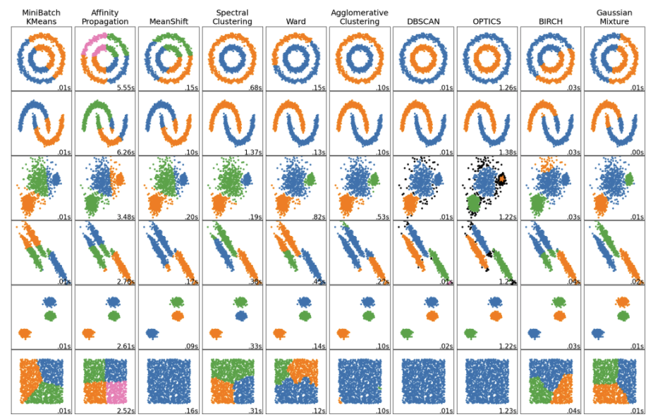

# Milestone Report
Bowen Chen (bowenc)

## Current Progress
We first tried to generate some synthetic data for validation purpose by using `sklearn.datasets.make_blobs`, but simply creating blobs with multiple centers leads to points not suitable for dbscan validation (since there are a lot overlap). So we adopted sklearn's sample data.

The synthetic data is dumped to files with certain format, and our dbscan implementation will read the data from file and output cluster result to file as we did for homework. Right now, we have implement our serial implementation of dbscan which is validated compared to `sklearn.cluster.DBSCAN`. We expect different parallel dbscan implementations will use the same file processing and timing code, while implements the dbscan function differently.

## Goals and deliverables
While implementing the serial version, we also looked in to some of the research done on parallel DBScan. As related to the course topics, we aim to have.
- implement G-DBSCAN (cuda)
- implement shared-memory and distributed-momory approach using the disjoint-set data structure
- compare and analysis the performance

## Plan
- 11.23-26: implement G-DBSCAn
- 11.27-11.30: implement shared-memory disjoint-set data structure
- 12.1-12.4: implement distributed-momory approach using the disjoint-set data structure
- 11.5-11.9: use a buffer days for further explore and write final project

## Concern you the most
We are wondering if we can build all those implementation into one binary and user can use command line to choose the parallel ways? Not sure if it could compile together.
